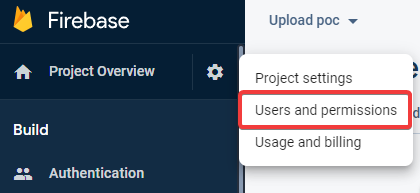
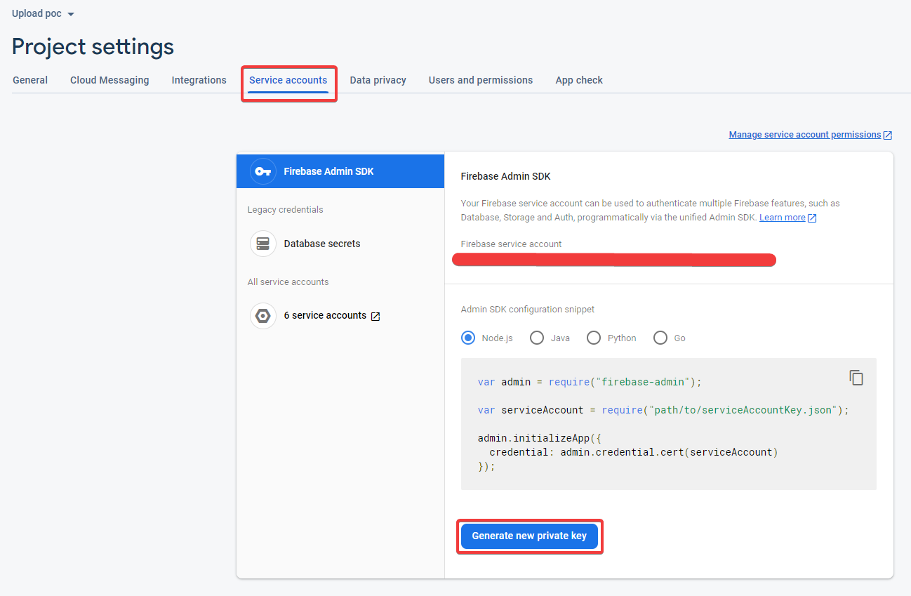
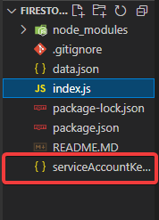
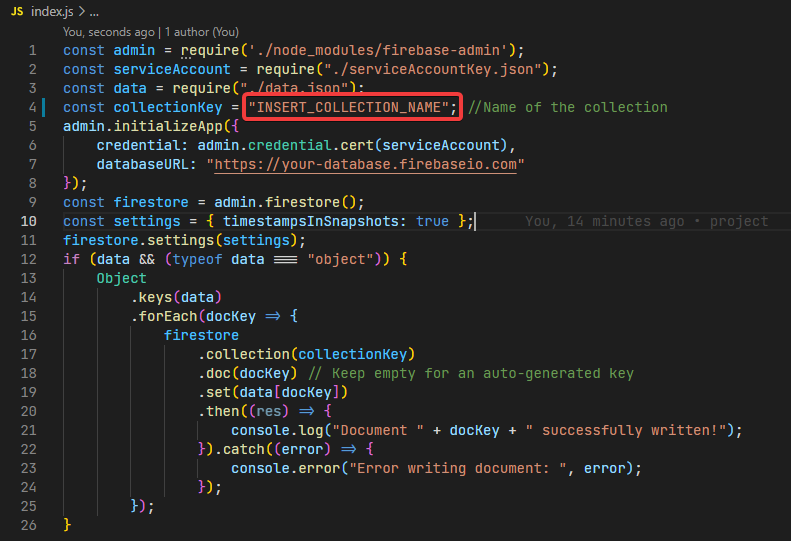
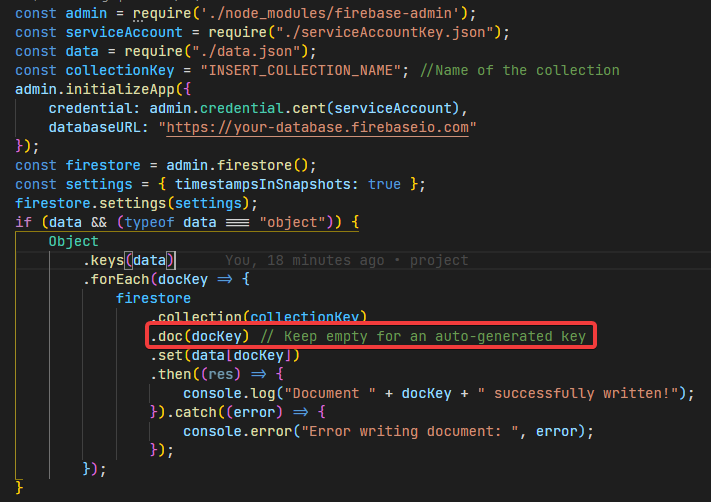

# Firestore upload node

A project for uploading json data to firestore.
Based on the following tutorial:
https://medium.com/@devesu/how-to-upload-data-to-firebase-firestore-cloud-database-63543d7b34c5

## Badges

[](https://firebase.google.com/?gclid=CjwKCAiA1JGRBhBSEiwAxXblwQQTXMQ2wD_Qncz3qD9TeST5tVHXcZPXTCa3X22a3T8DmeQ4H2EYExoChC0QAvD_BwE&gclsrc=aw.ds)
[](https://nodejs.org/en/)
[](https://www.npmjs.com)
[](./LICENSE)

## Installation and usage

1. Install node modules with npm

```bash
  npm install
```

2. Go to your project users and permissions.



3. Then head to service accounts and click generate new private key. This will download a JSON file.



4. Rename the file "serviceAccountKey.json" and add it to the project.



5. Replace the data in data.json with your own data

6. Inside index.js change INSERT_COLLECTION_NAME to the name of the collection you want to upload you data to. If the collection doesn't exist yet then it will be generated for you. I recommend uploading data to a test collection before you upload it to your main collection so you can check if the data got uploaded correctly.



7. If you want firestore to automatically generate keys then you should remove docKey from .doc(docKey).



8. Run the code

```bash
  npm upload
```

## Used By

This project is used by the following companies:

- [Sammy](https://www.sammy.nl)

## Author

- [@Raf Schapendonk](https://git.fhict.nl/I447972)
